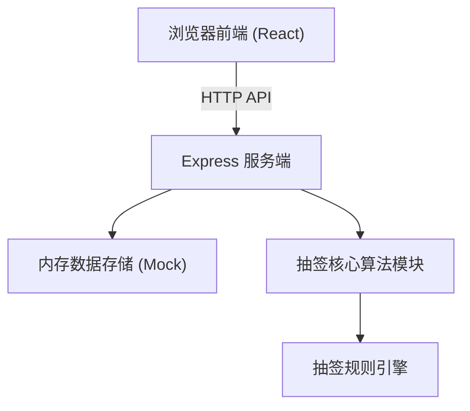
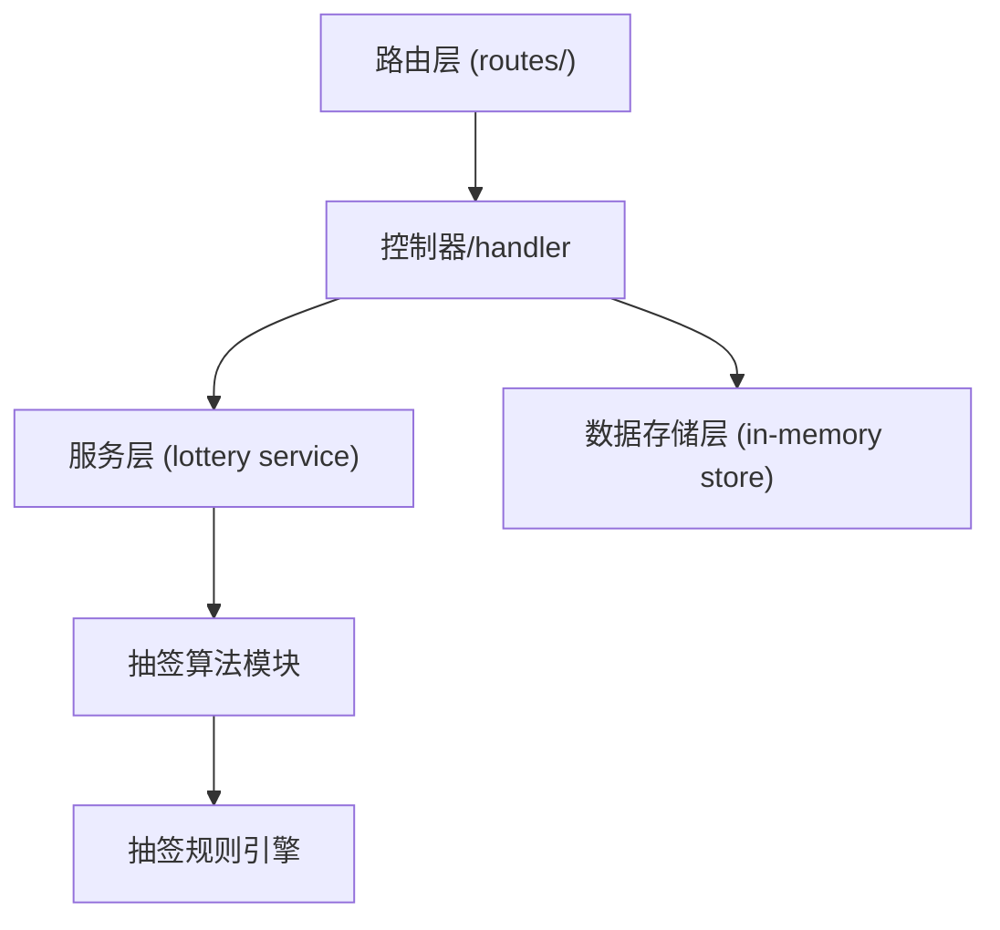
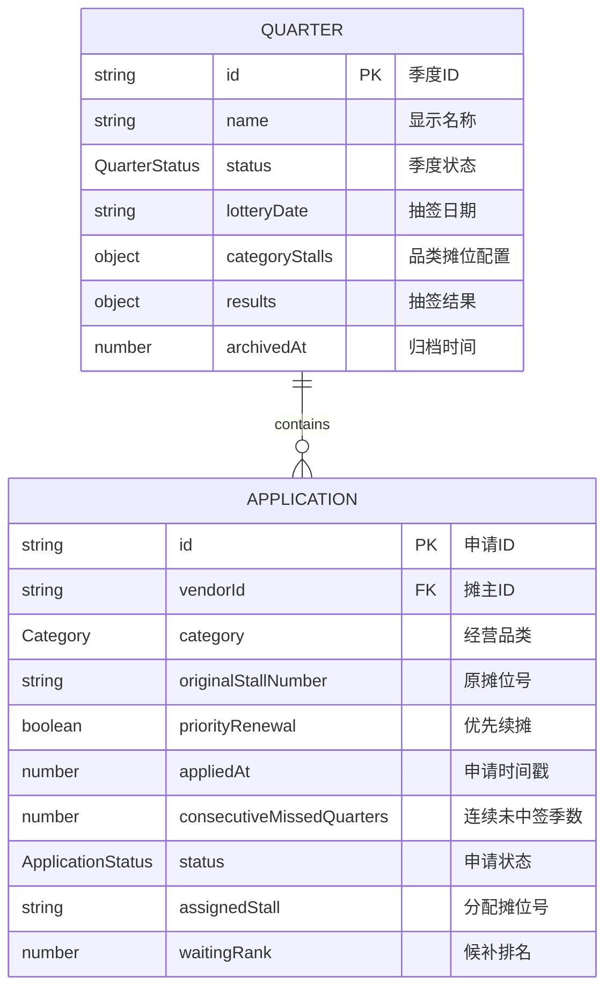

## 1. 架构设计



## 2. 技术说明

- 前端：React@18 + TypeScript + Vite + Tailwind CSS@3 + React Router@7 + Zustand
- 后端：Express@4 + TypeScript (TSX)
- 数据存储：内存 Mock 数据（带持久化模拟，服务重启可重置）
- 图标：lucide-react
- 状态管理：Zustand（前端） + 内存 Map（后端）

## 3. 路由定义

| 路由 | 用途 |
|------|------|
| / | 重定向至管理端首页或摊主查询页选择 |
| /admin | 管理端首页（概览） |
| /admin/applications | 申请管理 |
| /admin/lottery | 抽签管理 |
| /admin/results | 公示结果 |
| /admin/archive | 归档管理 |
| /vendor | 摊主查询首页 |
| /vendor/result | 摊主查询结果页 |
| /public-display | 实时公示大屏 |

## 4. API 定义

### 4.1 数据类型定义

```typescript
// 经营品类
type Category = 'vegetable' | 'seafood' | 'deli'; // 蔬果/水产/熟食

// 申请状态
type ApplicationStatus = 'pending' | 'winning' | 'waiting' | 'failed'; // 待抽签/中签/候补/未中签

// 季度状态
type QuarterStatus = 'collecting' | 'ready' | 'drawing' | 'published' | 'archived'; // 收集中/准备抽签/抽签中/已公示/已归档

// 摊位申请
interface Application {
  id: string; // 申请ID（自增序号）
  vendorId: string; // 摊主ID
  category: Category; // 申请品类
  originalStallNumber?: string; // 原摊位号（可选）
  priorityRenewal: boolean; // 是否优先续摊
  appliedAt: number; // 申请时间戳
  consecutiveMissedQuarters: number; // 连续未中签季数
  status: ApplicationStatus; // 申请状态
  assignedStall?: string; // 分配到的摊位号
  waitingRank?: number; // 候补排名
}

// 季度
interface Quarter {
  id: string; // 季度ID，如 "2026-Q2"
  name: string; // 显示名称
  status: QuarterStatus;
  lotteryDate?: string; // 抽签日期 ISO 字符串
  categoryStalls: Record<Category, string[]>; // 各品类摊位号配置
  applications: Application[];
  results?: {
    winning: Application[];
    waiting: Application[];
    failed: Application[];
  };
  archivedAt?: number; // 归档时间
}

// 品类摊位配置（Mock）
const STALL_CONFIG: Record<Category, string[]> = {
  vegetable: ['V001', 'V002', 'V003', 'V004', 'V005', 'V006', 'V007', 'V008'],
  seafood: ['S001', 'S002', 'S003', 'S004', 'S005'],
  deli: ['D001', 'D002', 'D003', 'D004'],
};
```

### 4.2 API 端点

| 方法 | 路径 | 描述 | 请求/响应 |
|------|------|------|-----------|
| GET | /api/quarters | 获取所有季度列表 | - | Quarter[] |
| GET | /api/quarters/:id | 获取单个季度详情（含申请和结果） | - | Quarter |
| POST | /api/quarters | 创建新季度 | { name, lotteryDate } | Quarter |
| PUT | /api/quarters/:id | 更新季度设置（抽签日等） | { lotteryDate } | Quarter |
| POST | /api/quarters/:id/archive | 归档季度 | - | Quarter |
| GET | /api/quarters/:id/applications | 获取申请列表 | - | Application[] |
| POST | /api/quarters/:id/applications | 新增申请 | { vendorId, category, originalStallNumber?, priorityRenewal } | Application |
| PUT | /api/quarters/:id/applications/:appId | 更新申请 | Partial<Application> | Application |
| DELETE | /api/quarters/:id/applications/:appId | 删除申请（抽签前） | - | { success: true } |
| POST | /api/quarters/:id/draw | 执行抽签（核心） | - | Quarter.results |
| GET | /api/quarters/:id/results | 获取抽签结果 | - | Quarter.results |
| GET | /api/quarters/:id/export | 导出CSV | - | CSV text |
| GET | /api/vendor/:vendorId | 摊主查询申请状态和结果 | - | { applications: Application[], quarterInfo } |

## 5. 服务端架构图



## 6. 数据模型

### 6.1 数据模型 ER 图



### 6.2 数据结构说明

- 使用内存 Map 存储季度数据，key 为季度ID
- 每个季度包含完整的申请列表和抽签结果
- 归档后季度数据标记为只读，修改 API 返回 403
