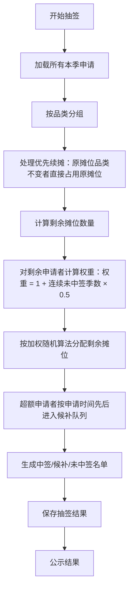

## 1. 产品概述

农贸市场管委会摊位季度轮转抽签公示系统，用于管理摊位申请、执行抽签、公示结果及归档全流程。解决传统人工抽签不透明、效率低、易出错的问题，确保摊位分配公平公正公开。

- 目标用户：农贸市场管理员、摊位经营者（摊主）
- 核心价值：公平抽签、透明公示、全程可追溯

## 2. 核心功能

### 2.1 用户角色

| 角色 | 登录方式 | 核心权限 |
|------|----------|----------|
| 管理员 | 管理员密码登录 | 录入申请、设定抽签日、执行抽签、公示结果、归档、导出CSV、浏览全部数据 |
| 摊主 | 摊主ID查询 | 查看个人申请状态、查看中签结果、浏览公示信息 |

### 2.2 功能模块

1. **管理端首页**：季度状态概览、快捷操作入口、当前季度数据统计
2. **申请管理页**：摊主申请录入（摊主ID、经营品类、原摊位号、是否优先续摊）、申请列表、批量导入
3. **抽签管理页**：设定抽签日、开启抽签、抽签进度展示、抽签规则说明
4. **公示结果页**：中签/候补/未中签三栏分栏展示、按品类筛选、搜索
5. **归档管理页**：历史季度列表、归档操作、归档后只读浏览
6. **摊主查询页**：输入摊主ID查看申请状态与中签结果
7. **实时公示大屏页**：面向公众的实时抽签结果展示

### 2.3 页面详情

| 页面名称 | 模块名称 | 功能描述 |
|------|------|----------|
| 管理端首页 | 季度概览卡片 | 显示当前季度状态、申请数、各品类摊位数统计 |
|  | 快捷操作区 | 快速跳转录入申请、开始抽签、公示等操作 |
| 申请管理 | 申请表单 | 录入摊主ID、选择经营品类（蔬果/水产/熟食）、填写原摊位号、勾选优先续摊 |
|  | 申请列表 | 展示所有申请，支持编辑、删除（抽签前）、按品类筛选 |
| 抽签管理 | 抽签设置 | 选择抽签日期时间、查看抽签规则说明 |
|  | 抽签执行 | 点击开始抽签按钮，显示抽签进度动画，服务端执行抽签逻辑 |
| 公示结果 | 三栏布局 | 中签栏（摊位号+摊主ID）、候补栏（排队顺序）、未中签栏 |
|  | 导出功能 | 导出CSV摘要（含全部申请及结果） |
|  | 筛选搜索 | 按品类筛选、按摊主ID搜索 |
| 归档管理 | 历史列表 | 展示所有季度及其状态（进行中/已公示/已归档） |
|  | 归档操作 | 对已公示季度执行归档，归档后数据只读 |
| 摊主查询 | 查询表单 | 输入摊主ID查询个人申请状态和结果 |
|  | 结果展示 | 展示申请信息、中签/候补/未中签状态、摊位号（若中签） |
| 公示大屏 | 三栏展示 | 大字体展示中签、候补、未中签名单，自动刷新 |

## 3. 核心流程

### 3.1 抽签全流程

管理员录入本季度所有摊主申请 → 管理员设定抽签日期 → 到达抽签日管理员开启抽签 → 服务端执行抽签算法 → 系统自动公示抽签结果 → 管理员确认后归档 → 归档后数据永久只读

### 3.2 抽签算法流程

## 4. 用户界面设计

### 4.1 设计风格

- 主色调：农贸市场绿色系（#2d5a27 深绿为主色，#52b788 翠绿为辅助），搭配暖橙色（#f4a261）作为强调色
- 中性色：米白色背景（#faf8f5），深灰文字（#1f2937）
- 按钮风格：圆角矩形，主色填充配白色文字，悬停时阴影加深
- 字体：标题使用思源宋体（衬线体，传统正式感），正文使用思源黑体（清晰易读）
- 布局风格：卡片式布局，分区明确，顶部导航栏
- 图标风格：lucide-react 线性图标，简洁清晰

### 4.2 页面设计概览

| 页面 | 模块 | UI元素 |
|------|------|--------|
| 管理端首页 | 概览卡片 | 数据统计卡片、绿色渐变背景、图标+数字布局 |
| 申请管理 | 表格列表 | 斑马纹表格、操作按钮、表单弹窗 |
| 抽签管理 | 抽签操作 | 大号抽签按钮、进度动画、规则说明卡片 |
| 公示结果 | 三栏布局 | 绿/黄/红三色分栏卡片、大字号展示、筛选栏 |
| 公示大屏 | 全屏展示 | 超大字号、自动滚动动画、三栏并排 |

### 4.3 响应式

- 桌面端优先设计（管理端主要在桌面使用）
- 摊主查询页适配移动端，方便摊主手机查询
- 公示大屏支持全屏展示

### 4.4 视觉特色

- 顶部品牌区域融入农贸市场传统元素
- 抽签过程添加动态转盘/进度动画
- 公示页面使用鲜明的色彩分栏（绿色中签、黄色候补、红色未中签）
